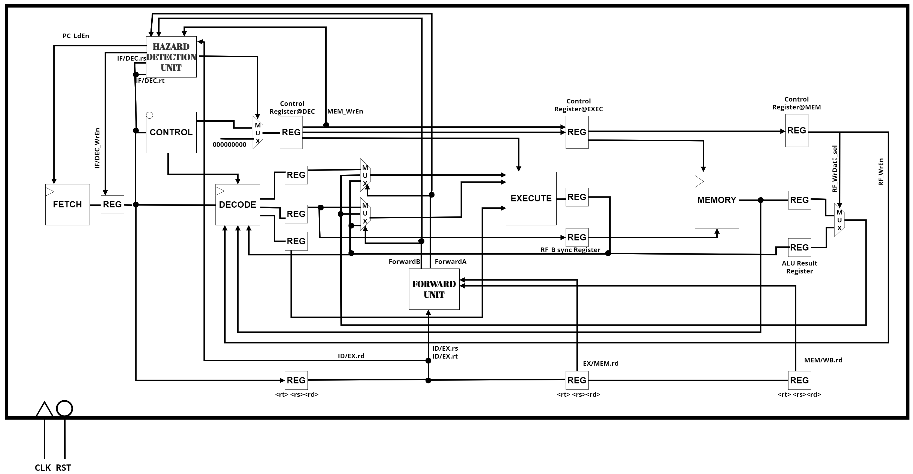
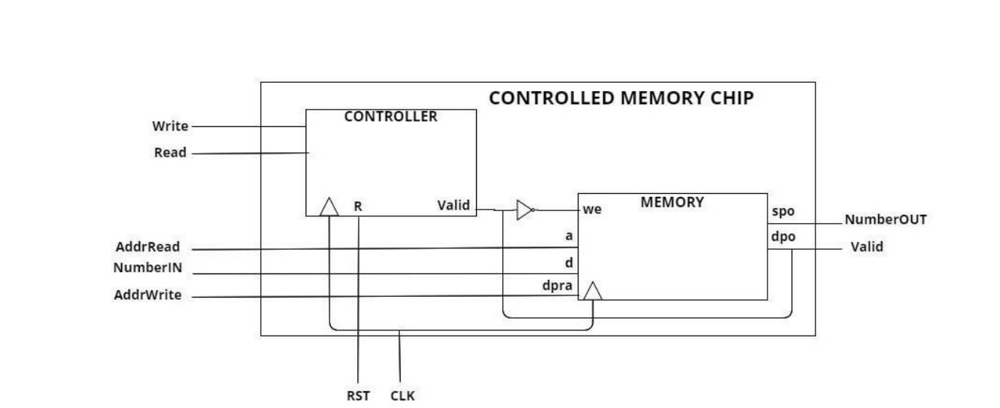
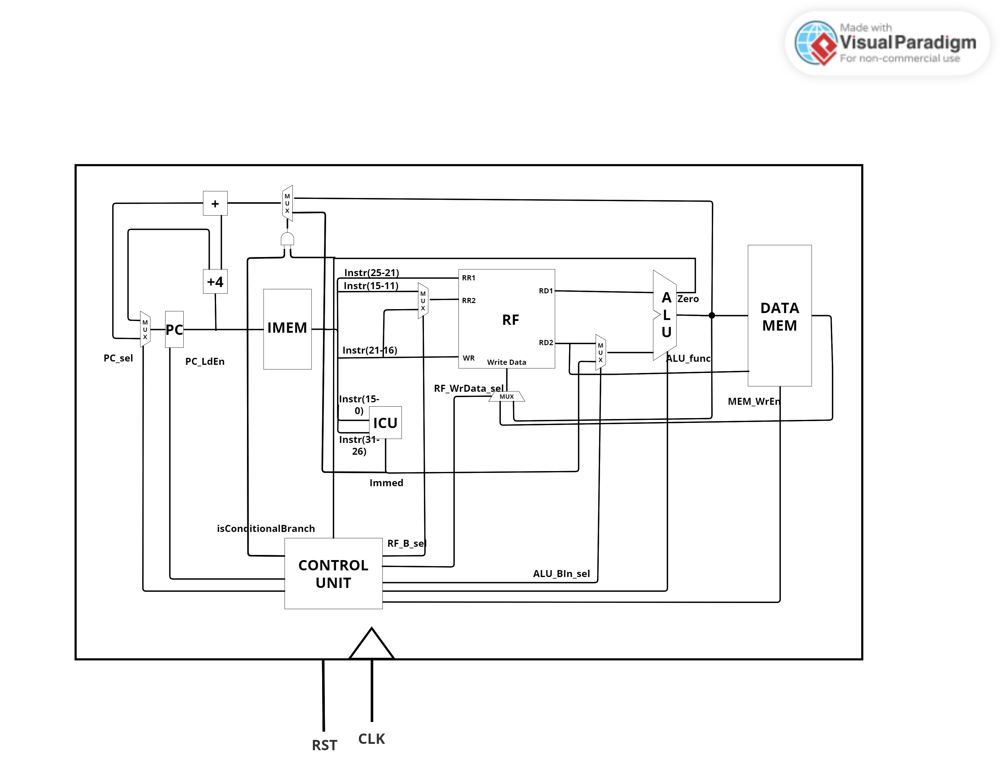
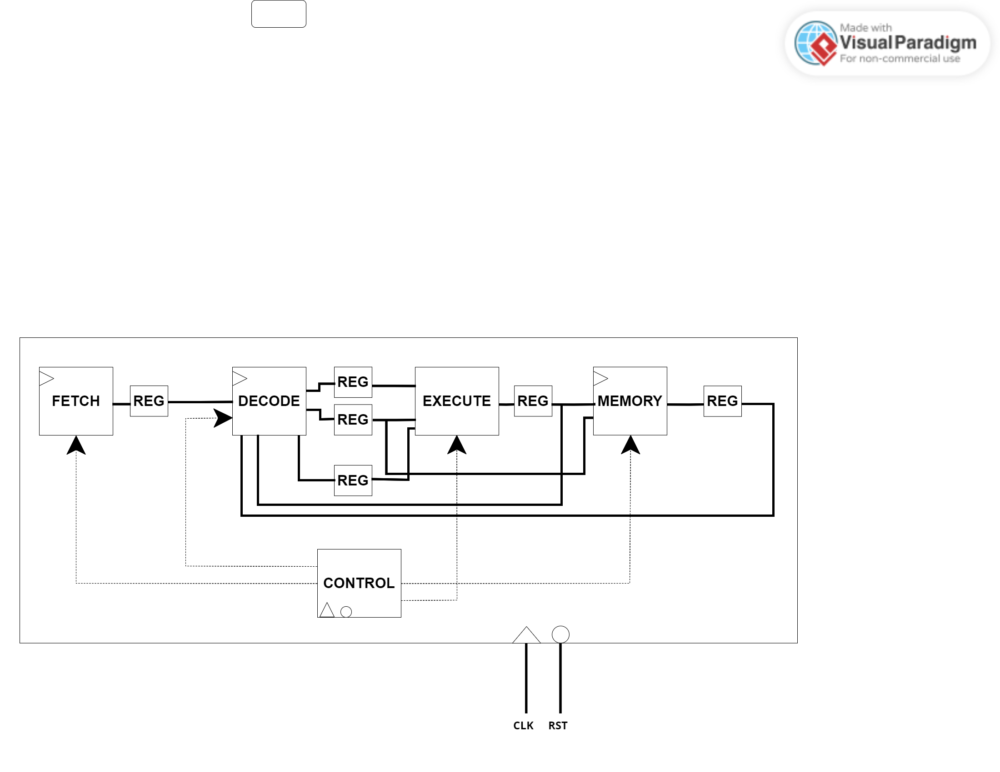
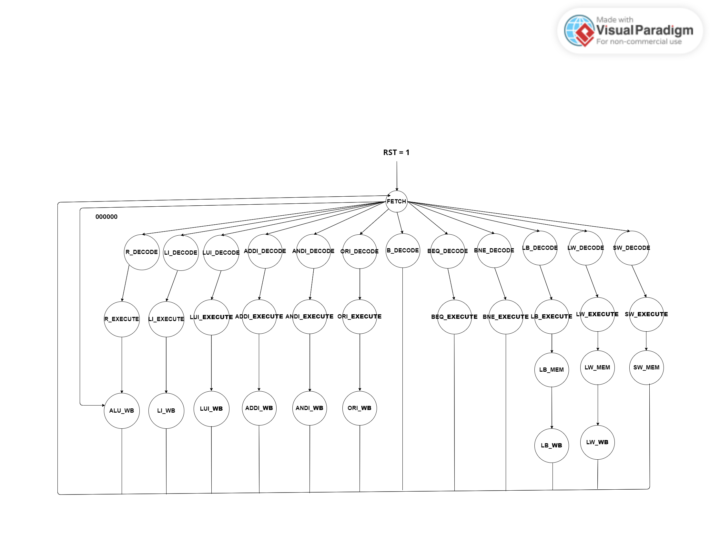
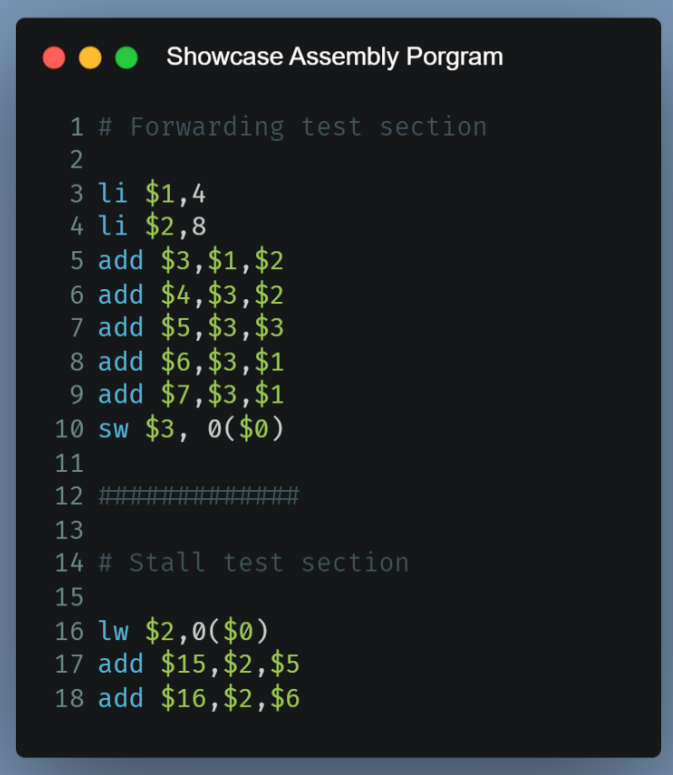

# Computer Organization - HRY302

VHDL lab exercises for the **Computer Organization** course at the Technical University of Crete (Spring 2024), simulated with Xilinx tools.

The labs build up step by step to a **pipelined MIPS-like processor** with forwarding and hazard detection:

## Labs

> [Lab 0](Project%20-%20part%200) - **Simple Memory System.** A 16-bit read/write memory unit in VHDL, introducing the Xilinx Core Generator.
>
> 

> [Lab 1](Project%20-%20part%201) - **Single-Cycle Processor.** An ALU and register file, combined with the datapath and control unit to build a single-cycle processor.
>
> 

> [Lab 2](Project%20-%20part%202) - **Multi-Cycle Processor.** The single-cycle design converted to multiple cycles, adding registers between the datapath stages and an FSM-based control unit.
>
> 

> 

> [Lab 3](Project%20-%20part%203) - **Pipelined Processor.** A pipelined version of the processor with pipeline registers, forwarding and stalls to handle data hazards.
>
> 

